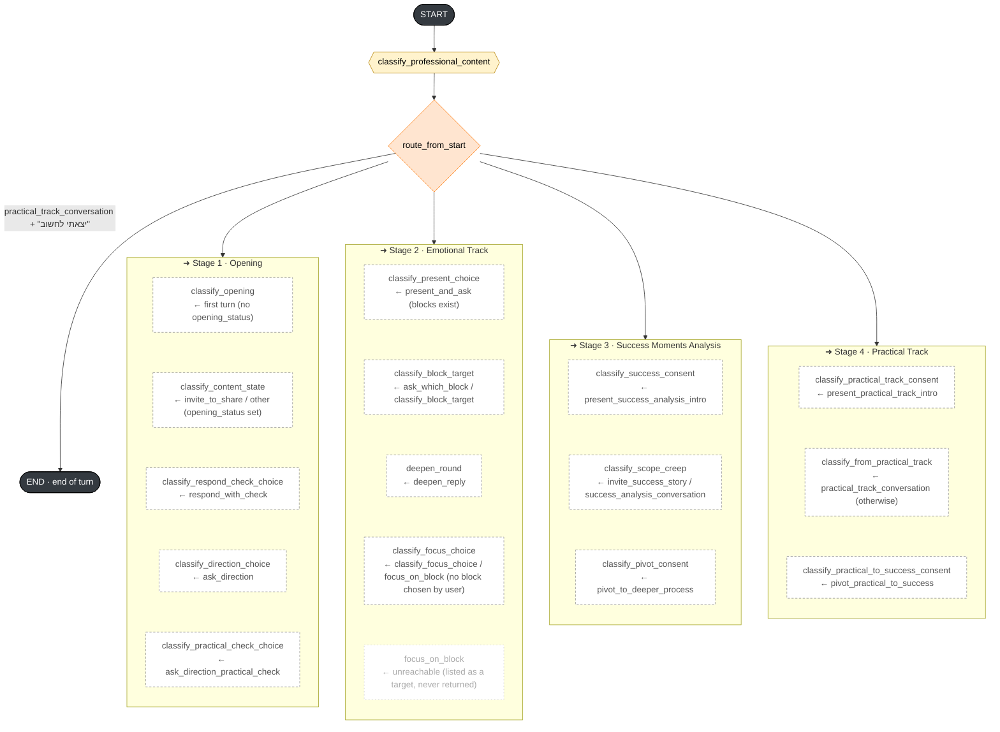
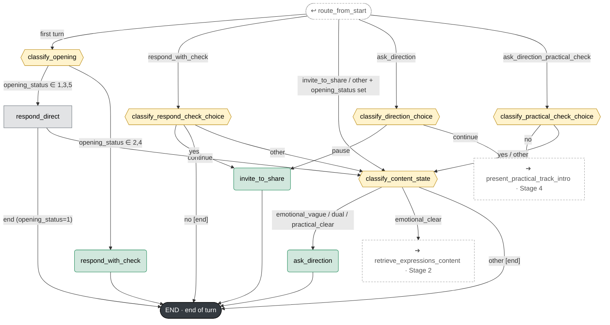
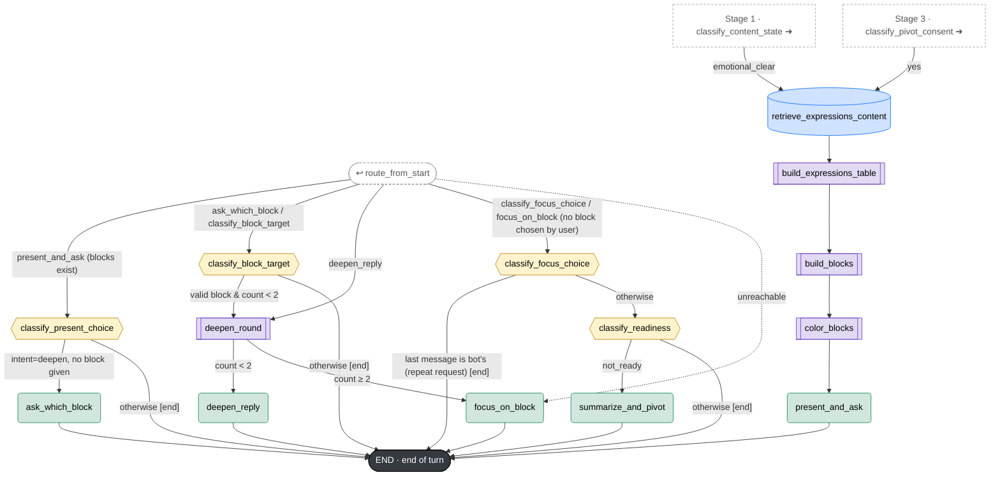
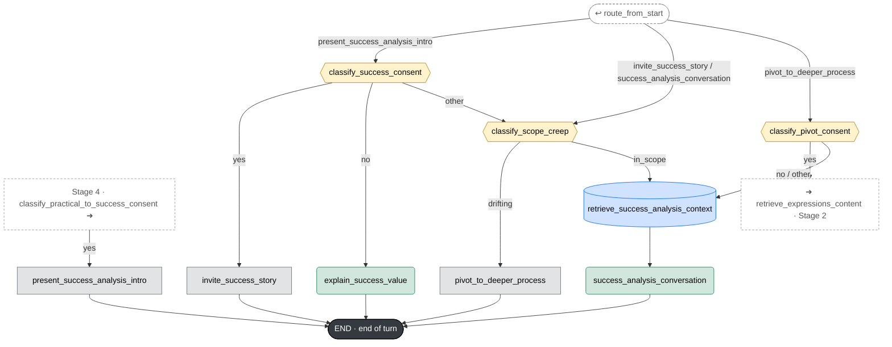
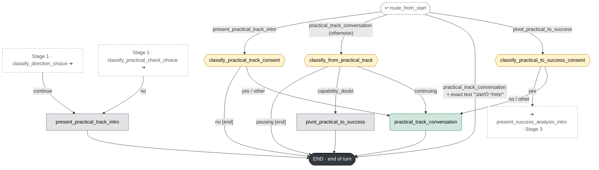

# Conversation Graph

The bot is a LangGraph graph that runs **once per user message ("turn")**. Every turn starts at `START`, passes through `classify_professional_content`, and then `route_from_start` picks the entry node based on `last_visited_node` (the last node run in the previous turn). This is how the conversation keeps continuity across turns. `END` means the turn is over and the bot waits for the user's next message.

The graph is split into five diagrams: entry & routing, and one per stage.

## Legend

| Shape / color | Node type |
|---|---|
| 🟨 Hexagon | Classifier (`classify_*`): classifies the user's reply, doesn't write to the user |
| ⬜ Gray rectangle | Fixed message (no LLM) |
| 🟩 Rounded rectangle | LLM-generated text |
| 🟦 Cylinder | Pinecone retrieval (RAG) |
| 🟪 Double rectangle | Internal processing (structured LLM, no user-facing message) |
| 🟧 Diamond | Router `route_from_start` |
| ⬛ | START / END (end of turn: the bot waits for the user's next message) |
| ⬚ Dashed | Reference to a node defined in another diagram |

A labeled edge is conditional: the label is the value returned by the routing function. An unlabeled edge runs immediately, within the same turn.

---

## Stage 0 · Entry & Turn Routing

Every turn starts here. `route_from_start` picks the entry point based on `last_visited_node`. Each block lists the entry nodes of that stage; the text after `←` is the `last_visited_node` value that routes there.

`classify_professional_content` runs on every turn. If the content is professional, it adds a disclaimer message and continues. `"יצאתי לחשוב"` means "I'm off to think".

---

## Stage 1 · Opening

---

## Stage 2 · Emotional Track: Expressions, Blocks, Deepening

`count` refers to `deepen_round_count`.

---

## Stage 3 · Success Moments Analysis

---

## Stage 4 · Practical Track

